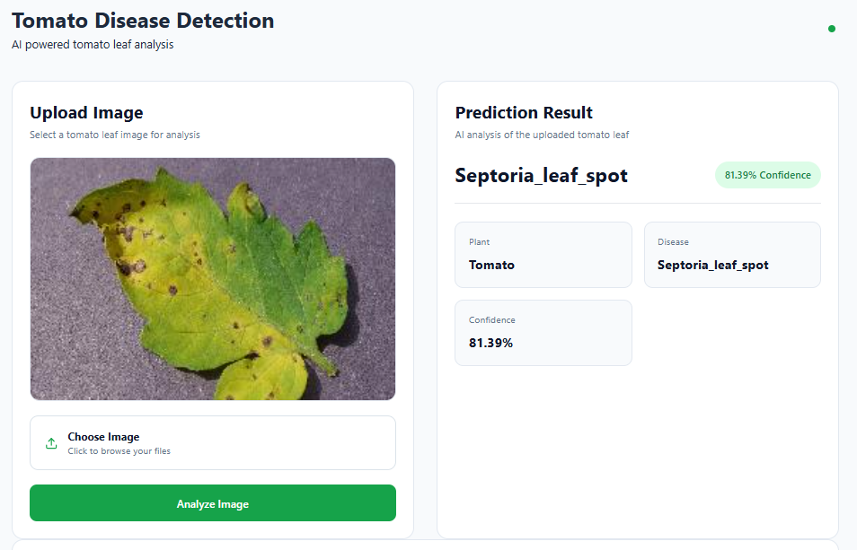

# Plant Disease Detection System

An AI-powered full-stack web application for detecting tomato leaf diseases using **TensorFlow Lite**, **React**, **Express**, and **PostgreSQL**. The system allows users to upload an image of a tomato leaf, performs real-time disease prediction using a trained deep learning model, and stores prediction history in a PostgreSQL database for future analysis.

---

## Overview

Plant diseases significantly reduce agricultural productivity and crop quality. Early disease detection enables farmers to apply timely treatment, minimizing losses and improving yields.

This project leverages a **TensorFlow Lite** deep learning model to classify tomato leaf diseases from uploaded images. The application provides a simple and intuitive interface where users can upload leaf images, receive AI-powered predictions, and review previous prediction records stored in a PostgreSQL database.

---

##  Features

- Tomato leaf disease detection
- AI-powered image classification using TensorFlow Lite
- Image upload and preprocessing
- Prediction confidence score
- Plant health score visualization
- Store prediction history in PostgreSQL
- View previous predictions
- Responsive dashboard interface
- Fast inference using TensorFlow Lite
- RESTful API built with Express

---

# Supported Diseases

The model can classify the following tomato leaf conditions:

- Bacterial Spot
- Early Blight
- Late Blight
- Leaf Mold
- Septoria Leaf Spot
- Spider Mites
- Target Spot
- Tomato Yellow Leaf Curl Virus
- Tomato Mosaic Virus
- Healthy
- Powdery Mildew

---

# Tech Stack

## Frontend

- React
- TypeScript
- Tailwind CSS
- Lucide React
- Fetch API

---

## Backend

- Node.js
- Express.js
- TypeScript
- Multer
- PostgreSQL
- pg
- dotenv

---

## Artificial Intelligence

- TensorFlow
- TensorFlow Lite
- NumPy
- Pillow
- Python

---

## Database

PostgreSQL

---

# System Architecture

```
                User
                  │
                  ▼
        React Frontend
                  │
                  ▼
          Express API Server
                  │
       Upload Leaf Image
                  │
                  ▼
       Python Prediction Script
                  │
                  ▼
      TensorFlow Lite Model
                  │
          Disease Prediction
                  │
                  ▼
         PostgreSQL Database
                  │
                  ▼
      Prediction History API
```

---

# Project Structure

```
Plant-Disease-Detection-System
│
├── client
│   ├── src
│   │   ├── App.tsx
│   │   ├── main.tsx
│   │   ├── index.css
│   │   └── assets
│   │
│   └── package.json
│
├── server
│   ├── models
│   │   ├── tomato_disease_model.tflite
│   │   └── labels.json
│   │
│   ├── uploads
│   │
│   ├── src
│   │   ├── db.ts
│   │   ├── inference.ts
│   │   ├── predict.py
│   │   └── server.ts
│   │
│   ├── package.json
│   └── .env
│
└── README.md
```

---

# Installation

## Clone Repository

```bash
git clone https://github.com/yourusername/plant-disease-detection-system.git

cd plant-disease-detection-system
```

---

# Backend Setup

Navigate into the server folder.

```bash
cd server
```

Install dependencies.

```bash
pnpm install
```

Install Python dependencies.

```bash
pip install tensorflow pillow numpy
```

Create an environment file.

```
DATABASE_URL=your_postgresql_connection_string
```

Run the server.

```bash
pnpm run dev
```

---

# Frontend Setup

Navigate into the client folder.

```bash
cd client
```

Install packages.

```bash
pnpm install
```

Start the application.

```bash
pnpm run dev
```

---

# Database

Create the predictions table.

```sql
CREATE TABLE predictions (

    id SERIAL PRIMARY KEY,

    image_name VARCHAR(255),

    plant_name VARCHAR(100),

    disease VARCHAR(100),

    confidence NUMERIC(5,2),

    health_score INTEGER,

    created_at TIMESTAMP DEFAULT CURRENT_TIMESTAMP

);
```

---

# Image Processing Pipeline

1. User uploads tomato leaf image.
2. Express receives the image.
3. Multer stores the image.
4. Python inference script is executed.
5. Image is resized.
6. TensorFlow Lite model performs inference.
7. Highest probability class is selected.
8. Confidence score is calculated.
9. Health score is assigned.
10. Prediction is stored in PostgreSQL.
11. Response is returned to the frontend.

---

# Health Score Mapping

| Disease | Health Score |
|----------|-------------:|
| Healthy | 100% |
| Early Blight | 70% |
| Leaf Mold | 65% |
| Bacterial Spot | 60% |
| Spider Mites | 60% |
| Septoria Leaf Spot | 55% |
| Target Spot | 55% |
| Late Blight | 30% |
| Tomato Yellow Leaf Curl Virus | 25% |
| Tomato Mosaic Virus | 20% |

---

# Example Workflow

1. Open the web application.
2. Select a tomato leaf image.
3. Click **Analyze Image**.
4. Wait for the AI model to process the image.
5. View:
   - Disease prediction
   - Confidence score
   - Plant health score
6. The prediction is automatically saved to PostgreSQL.
7. View previous predictions in the dashboard.

---

# Screenshots




# Author

**Elisha Kiplangat**

Software Engineer | Full-Stack Developer | AI & Machine Learning Enthusiast

